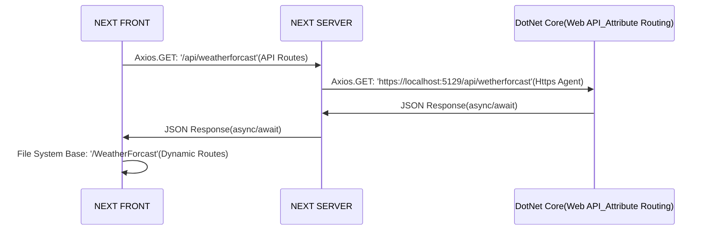

## 実行手順

```bash
git clone 
```

```bash
dotnet run
```

## NEXTフロントとDotNet Core通信



> **Attention:**

- NEXT(HTTP) ----> DotNet Core(HTTPS)
    - サーバー内部通信(Axios: Https Agent)
    - ブラウザ外部通信(CORS: api server need to add trust origin url)
- DotNet Core(HTTPS) ----> NEXT(HTTP)
    - SPA Proxy(publish file)

> **Problem:**

- NEXTのHTTPS化問題
    - NEXT公式から「カスタマイズサーバー」非推奨（nginx/apacha reverse proxy??）
- NEXT/REACTログ問題
    - フリーモジュール少ない(browser: console.log server: stdout --> Pino構造化ログ)
    - 課金：[logflare](https://logflare.app/pricing)   |  [sentry-エラーハンドリング](https://sentry.io/pricing/)
- NEXT/REACTユニットテスト問題
