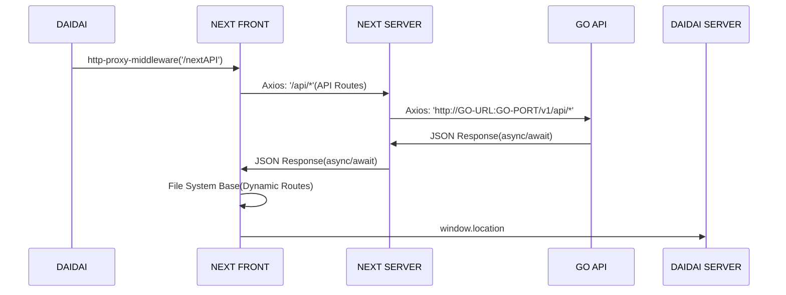

## NEXTとDaiDaiとGO API通信プロセス

> **Attention:**

- NEXT(HTTP) ----> DotNet Core(HTTPS)
    - サーバー内部通信(Axios: Https Agent)
    - ブラウザ外部通信(CORS: api server need to add trust origin url)
- DotNet Core(HTTPS) ----> NEXT(HTTP)
    - SPA Proxy(publish file)

