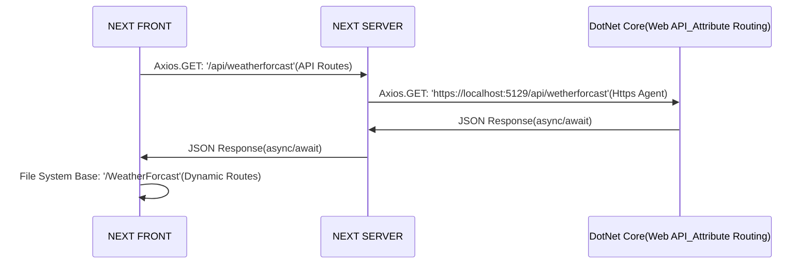

## 実行手順

```bash
git clone 
```

## NEXTフロントとDotNet Core通信


```mermaid
sequenceDiagram
    participant NEXT FRONT
    participant NEXT SERVER
    participant DotNet Core(Web API_Attribute Routing)
    NEXT FRONT->>NEXT SERVER: Axios.GET: '/api/weatherforcast'(API Routes)
    NEXT SERVER->>DotNet Core(Web API_Attribute Routing): Axios.GET: 'https://localhost:5129/api/wetherforcast'(Https Agent)
    DotNet Core(Web API_Attribute Routing)->>NEXT SERVER: JSON Response(async/await)
    NEXT SERVER->>NEXT FRONT: JSON Response(async/await)
    NEXT FRONT->>NEXT FRONT: File System Base: '/WeatherForcast'(Dynamic Routes)
```
